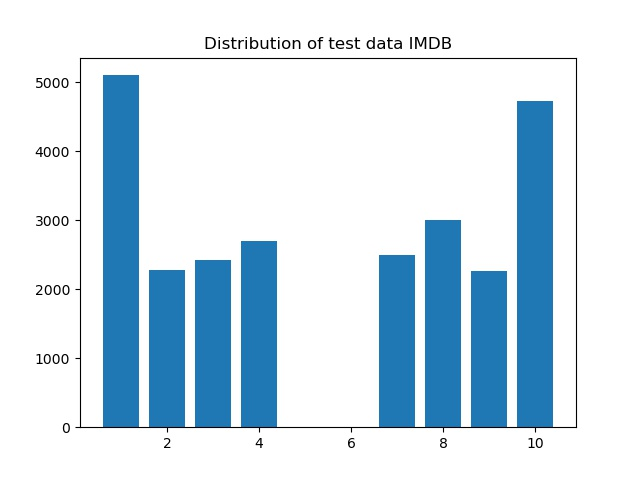
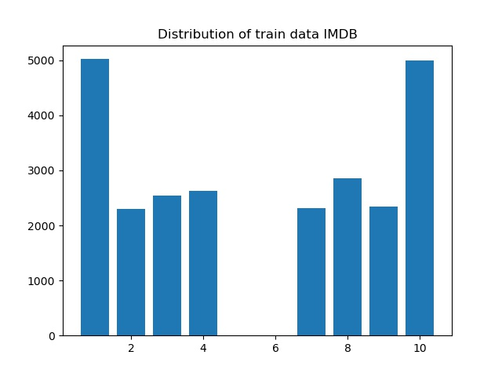
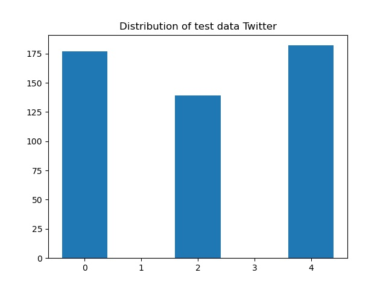

# NLP_Project
By Fabian Lange
## Project Description
Predict the polarity of tweets from the sentiment 140 dataset being labeled with positive, neutral or negative based on a model that will be trained with the IMDB Reviews dataset including film reviews and being also labeled positive, neutral or negative.
The goal would be to find out, whether polarity from film reviews is found also in tweets.

# Datasets
This project uses the following two datasets.

## IMDB Reviews dataset
The english IMBD Reviews dataset contains 50,000 labeled film reviews that are split equally into a train and test dataset. Labeling includes an integer rating on a scale from 1 to 10 and a boolean indicator whether a review is positive or negative. The owners of this dataset define that a negative review has a score <= 4 out of 10, and a positive review has a score >= 7 out of 10. Therefore, reviews that are neutral are not included in this dataset. Positive and negative reviews are split equally among training and test dataset such that there are 12,500 samples for each category out of train-positive, train-negative, test-positive and test-negative. Each sample is given as a .txt file named with an index and the rating, structured in four files, one for each of the above mentioned categories.

Distribution plot test|Distribution plot train
-|-
|

For both testing and training dataset the distribution of ratings is almost equal, except of the above explained missing reviews with a rating of 5 or 6 and the high density for ratings of 1 or 10. Those extremes are included almost twice as often by the owner of this dataset to emphasize their importance and enable better machine learning.

The average word count of a sample from the imdb reviews contains 231.16 words. A first estimation for the Vocab [(Link to the Vocab File)](output/vocab_imdb.csv) size of the overall dataset (e.g. including test and training data) with the nklt word tokenizer, lowercased without special characters and removed stopwords yields to 116475 different tokens. The generation by script takes some time.

### Source Paper of the IMDB Reviews dataset:
Andrew L. Maas, Raymond E. Daly, Peter T. Pham, Dan Huang, Andrew Y. Ng, and Christopher Potts. 2011. Learning Word Vectors for Sentiment Analysis. In Proceedings of the 49th Annual Meeting of the Association for Computational Linguistics: Human Language Technologies, pages 142–150, Portland, Oregon, USA. Association for Computational Linguistics.

### Link to the dataset:
https://ai.stanford.edu/~amaas/data/sentiment/

## Sentiment 140 dataset
The english Sentiment 140 dataset contains 1.6 Million original tweets that have been annotated with 0 = negative or 4 = positive by the team of Sentiment 140 assuming that tweets with positive emoticons, like :), are positive, and tweets with negative emoticons, like :(, are negative. Of the training samples, exactly 50 % are labeled as positive and 50 % are labeled as negative. Furthermore, the dataset contains test data which consists of 498 samples that are labeled by humans with 0 = negative, 2 = neutral or 4 = positive. Data is formatted in 6 fields, but only the first field indicating the sentiment and the last field including the whole tweet are of interest. The distribution of the test samples is represented in the graph below.



An average sample of this dataset contains a tweet with 13.18 words. The vocabulary size is 729903 and the full vocabulary can be found under this [Link to the Vocab File](output/vocab_twitter.csv). Even after removing special characters, lowercasing everything and removing stopwords, there are still many tokens which are twitter usernames or words that are intentionally written wrong by extending them with more characters.

### Source Paper of the Sentiment 140 dataset:
Alec Go, Richa Bhayani, Lei Huang. Twitter Sentiment Classification using Distant Supervision. URL: https://cs.stanford.edu/people/alecmgo/papers/TwitterDistantSupervision09.pdf.

### Link to the dataset:
http://help.sentiment140.com/for-students/

# Simple Linguistic Model
A Naive Bayes Classifier was trained on a subset of 2000 IMDB training samples and evaluated on 2000 IMDB test samples. Therefore, the first 70000 words of the [Vocab](output/vocab_imdb.csv) were used to generate the features. For every word that is part of the document, the feature contains(word) is true, for every other word it is false. The tokenizer that was used for generating the vocab was also used for generating the features. The models statistics show that it works quite well:

Model Statistics|Number
-|-
Total predictions   |2000
Correct predictions |1714
False-positives     |116
False-negatives     |170
Accuracy            |0.857
Precision           |0.8773784355179705
Recall              |0.83
F-Measure           |0.8530318602261049

The most informative features are shown below. Those varied significantly for different sizes of the train set. A model that is fitted on more, less or different samples can lead to a totally different set of most informative features.

Most Informative Features|Class|Ratio
-|-|-
contains(pointless) = True      |neg : pos    |     17.0 : 1.0
contains(waste) = True          |neg : pos    |     16.2 : 1.0
contains(delightful) = True     |pos : neg    |     15.0 : 1.0
contains(rubbish) = True        |neg : pos    |     15.0 : 1.0
contains(stargate) = True       |pos : neg    |     15.0 : 1.0
contains(titanic) = True        |pos : neg    |     15.0 : 1.0
contains(zombies) = True        |neg : pos    |     14.3 : 1.0
contains(911) = True            |pos : neg    |     13.7 : 1.0
contains(910) = True            |pos : neg    |     13.0 : 1.0
contains(wasted) = True         |neg : pos    |     12.4 : 1.0

# Examples for Model Predicitions
Below, there are some examples of model predictions including imaginary examples and real examples. The real examples contain all of the following outcomes: True-positive, True-negative, False-Negative and False-Positive predictions. The model is not good at learning the real meaning of sentences since it only treats each word seperately. For example, in the first wrongly predicted review, it says "not bad" which cannot be understood as positive feedback by the model. In addition to that, the model fails to include the fact that words can occur more than once. It is only looking whether a review contains a word or not.

# Further Steps
In the next project step, the tokenizer for building the vocab and for generating the featureset of an IMDB sample can be improved. Currently, the vocab contains a high amount of tokens that are most probably not helpful at all to predict whether a sample is positive or negative. That is why there could be introduced stemming or lemmatization. Furthermore, it should be enough to generate the vocab only based on the train_set and to exclude all tokens that appear only seldom (maybe appearances < 5). This could enable to train the model based on a larger training set. In addition to that, the frequency of words could be included, similar to a bag of words model. In the end, the project goal of comparing the ability to also predict the polarity of twitter samples can be discovered by using the classifier for the twitter test set and calculating all the statistics as well.

## Some imaginary examples
Predicting:  
```
What a great movie. I really like it. It was so much fun watching it with my family.  
```
Result: pos  
```
Predicting: This movie was so bad an boring, I really hated it. The plot is complete waste and the whole storyline was awful.  
```
Result: neg  

## Some real examples that were classified correct
Predicting:  
```
I went and saw this movie last night after being coaxed to by a few friends of mine. I'll admit that I was reluctant to see it because from what I knew of Ashton Kutcher he was only able to do comedy. I was wrong. Kutcher played the character of Jake Fischer very well, and Kevin Costner played Ben Randall with such professionalism. The sign of a good movie is that it can toy with our emotions. This one did exactly that. The entire theater (which was sold out) was overcome by laughter during the first half of the movie, and were moved to tears during the second half. While exiting the theater I not only saw many women in tears, but many full grown men as well, trying desperately not to let anyone see them crying. This movie was great, and I suggest that you go see it before you judge.
```

Correct Value: pos  
Model predicts the correct value  

Predicting:  
```
I saw this film in a sneak preview, and it is delightful. The cinematography is unusually creative, the acting is good, and the story is fabulous. If this movie does not do well, it won't be because it doesn't deserve to. Before this film, I didn't realize how charming Shia Lebouf could be. He does a marvelous, self-contained, job as the lead. There's something incredibly sweet about him, and it makes the movie even better. The other actors do a good job as well, and the film contains moments of really high suspense, more than one might expect from a movie about golf. Sports movies are a dime a dozen, but this one stands out.  This is one I'd recommend to anyone.
```

Correct Value: pos  
Model predicts the correct value

Predicting:  
```
Bill Paxton has taken the true story of the 1913 US golf open and made a film that is about much more than an extra-ordinary game of golf. The film also deals directly with the class tensions of the early twentieth century and touches upon the profound anti-Catholic prejudices of both the British and American establishments. But at heart the film is about that perennial favourite of triumph against the odds. The acting is exemplary throughout. Stephen Dillane is excellent as usual, but the revelation of the movie is Shia LaBoeuf who delivers a disciplined, dignified and highly sympathetic performance as a working class Franco-Irish kid fighting his way through the prejudices of the New England WASP establishment. For those who are only familiar with his slap-stick performances in "Even Stevens" this demonstration of his maturity is a delightful surprise. And Josh Flitter as the ten year old caddy threatens to steal every scene in which he appears. A old fashioned movie in the best sense of the word: fine acting, clear directing and a great story that grips to the end - the final scene an affectionate nod to Casablanca is just one of the many pleasures that fill a great movie.
```

Correct Value: pos  
Model predicts the correct value

Predicting:  
```
Once again Mr. Costner has dragged out a movie for far longer than necessary. Aside from the terrific sea rescue sequences, of which there are very few I just did not care about any of the characters. Most of us have ghosts in the closet, and Costner's character are realized early on, and then forgotten until much later, by which time I did not care. The character we should really care about is a very cocky, overconfident Ashton Kutcher. The problem is he comes off as kid who thinks he's better than anyone else around him and shows no signs of a cluttered closet. His only obstacle appears to be winning over Costner. Finally when we are well past the half way point of this stinker, Costner tells us all about Kutcher's ghosts. We are told why Kutcher is driven to be the best with no prior inkling or foreshadowing. No magic here, it was all I could do to keep from turning it off an hour in.
```

Correct Value: neg  
Model predicts the correct value

Predicting:  
```
A funny thing happened to me while watching "Mosquito": on the one hand, the hero is a deaf-mute and the director is totally unable to make us understand why he does what he does (mutilating mannequins...er, excuse me, corpses) through his images. On the other hand, the English version at least is very badly dubbed. So I found myself wishing there had been both more AND less dialogue at the same time! This film is stupid (funny how this guy has access to every graveyard and mortuary in his town) and lurid (where would we be in a 70s exploitationer without our gratuitous lesbian scene?). Not to mention the "romantic" aspect (oh, how sweet!)...Miss it. (*)
```

Correct Value: neg  
Model predicts the correct value

Predicting:  
```
This German horror film has to be one of the weirdest I have seen. I was not aware of any connection between child abuse and vampirism, but this is supposed based upon a true character. Our hero is deaf and mute as a result of repeated beatings at the hands of his father. he also has a doll fetish, but I cannot figure out where that came from. His co-workers find out and tease him terribly. During the day a mild-manner accountant, and at night he breaks into cemeteries and funeral homes and drinks the blood of dead girls. They are all attractive, of course, else we wouldn't care about the fact that he usually tears their clothing down to the waist. He graduates eventually to actually killing, and that is what gets him caught. Like I said, a very strange movie that is dark and very slow as Werner Pochath never talks and just spends his time drinking blood.
```

Correct Value: neg  
Model predicts the correct value

## Some real examples that were classified wrong

Predicting:  
```
I have certainly not seen all of Jean Rollin's films, but they mostly seem to be bloody vampire naked women fests, which if you like that sort of thing is not bad, but this is a major departure and could almost be Cronenberg minus the bio-mechanical nightmarish stuff. Except it's in French with subtitles of course. A man driving on the road at night comes across a woman that is in her slippers and bathrobe and picks her up, while in the background yet another woman lingers, wearing nothing. As they drive along it's obvious that there is something not right about the woman, in that she forgets things almost as quickly as they happen. Still though, that doesn't prevent the man from having sex with her once they return to Paris & his apartment. The man leaves for work and some strangers show up at his place and take the woman away to this 'tower block', a huge apartment building referred to as the Black Tower, where others of her kind (for whom the 'no memory' things seems to be the least of their problems) are being held for some reason. Time and events march by in the movie, which involve mostly trying to find what's going on and get out of the building for this woman, and she does manage to call Robert, the guy that picked her up in the first place, to come rescue her. The revelation as to what's going on comes in the last few moments of the movie, which has a rather strange yet touching end to it. In avoiding what seemed to be his "typical" formula, Rollin created, in this, what I feel is his most fascinating and disturbing film. I like this one a lot, check it out. 8 out of 10.
```

Correct Value: pos  
Model predicts the wrong value

Predicting:  
```
While I can't say whether or not Larry Hama ever saw any of the old cartoons, I would think that writing said cartoons, file cards, and some of the comics would count for something. For fans of the old cartoon, this is pretty much a continuation of the same, except with a few new characters - and a more insane Cobra Commander. We still have all the old favorites too, but on a personal note, one thing that always irritated me was this "Duke in charge" stuff, when there are tons of other *officers* around instead. The battle sequences are similar to the old series as well; the main trick here seems to be the CGI. It's overall pretty good, if not a little over-the-top.</i>
```

Correct Value: pos  
Model predicts the wrong value

Predicting:  
```
I blame "Birth of a Nation" myself - for commencing the long-running tradition of Hollywood travesties of history, of which there can be few greater examples than this. Apart from getting the names of Custer and his 7th Cavalry, Crazy Horse and the Sioux and President Grant spelt right, the geography correct and the fact that Custer and his men were indeed wiped out to a man, the rest just takes hyperbole and invention to ludicrous limits. Throw in some downright hackneyed scenes of the purest exposition, (try Custer and his wife's learning of the phony "Gold Rush" to excuse the invasion of the Sioux territory, Custer's testimony in front of Congress pleading the rights of the Red Indians and to top it all, Custer's storming into the president's office to beg to return to his post), honestly there's plenty more of the same, some of these scenes almost comical in their corniness... ...And yet, and yet, it's still a great actioner with Flynn as dashing as ever, DeHavilland as beguiling as ever, the young Anthony Quinn getting a start as Crazy Horse and director Walsh as barnstorming as ever in his depiction of crowd scenes and of course the tumultuous action sequences. Ford taught us in "Liberty Valance" to believe the legend before the truth. Here I think we're closer to the legend of the legend but hey, it's only a movie and a rollicking, wonderfully enjoyable classic Hollywood movie at that!
```

Correct Value: pos  
Model predicts the wrong value

Predicting:  
```
Not even the Beatles could write songs everyone liked, and although Walter Hill is no mop-top he's second to none when it comes to thought provoking action movies. The nineties came and social platforms were changing in music and film, the emergence of the Rapper turned movie star was in full swing, the acting took a back seat to each man's overpowering regional accent and transparent acting. This was one of the many ice-t movies i saw as a kid and loved, only to watch them later and cringe. Bill Paxton and William Sadler are firemen with basic lives until a burning building tenant about to go up in flames hands over a map with gold implications. I hand it to Walter for quickly and neatly setting up the main characters and location. But i fault everyone involved for turning out Lame-o performances. Ice-t and cube must have been red hot at this time, and while I've enjoyed both their careers as rappers, in my opinion they fell flat in this movie. It's about ninety minutes of one guy ridiculously turning his back on the other guy to the point you find yourself locked in multiple states of disbelief. Now this is a movie, its not a documentary so i wont waste my time recounting all the stupid plot twists in this movie, but there were many, and they led nowhere. I got the feeling watching this that everyone on set was sord of confused and just playing things off the cuff. There are two things i still enjoy about it, one involves a scene with a needle and the other is Sadler's huge 45 pistol. Bottom line this movie is like domino's pizza. Yeah ill eat it if I'm hungry and i don't feel like cooking, But I'm well aware it tastes like crap. 3 stars, meh.
```

Correct Value: neg  
Model predicts the wrong value

Predicting:  
```
Brass pictures (movies is not a fitting word for them) really are somewhat brassy. Their alluring visual qualities are reminiscent of expensive high class TV commercials. But unfortunately Brass pictures are feature films with the pretense of wanting to entertain viewers for over two hours! In this they fail miserably, their undeniable, but rather soft and flabby than steamy, erotic qualities non withstanding. Senso '45 is a remake of a film by Luchino Visconti with the same title and Alida Valli and Farley Granger in the lead. The original tells a story of senseless love and lust in and around Venice during the Italian wars of independence. Brass moved the action from the 19th into the 20th century, 1945 to be exact, so there are Mussolini murals, men in black shirts, German uniforms or the tattered garb of the partisans. But it is just window dressing, the historic context is completely negligible. Anna Galiena plays the attractive aristocratic woman who falls for the amoral SS guy who always puts on too much lipstick. She is an attractive, versatile, well trained Italian actress and clearly above the material. Her wide range of facial expressions (signalling boredom, loathing, delight, fear, hate ... and ecstasy) are the best reason to watch this picture and worth two stars. She endures this basically trashy stuff with an astonishing amount of dignity. I wish some really good parts come along for her. She really deserves it.
```

Correct Value: neg  
Model predicts the wrong value

Predicting:  
```
Wealthy horse ranchers in Buenos Aires have a long-standing no-trading policy with the Crawfords of Manhattan, but what happens when the mustachioed Latin son falls for a certain Crawford with bright eyes, blonde hair, and some perky moves on the dance floor? 20th Century-Fox musical has a glossy veneer yet seems a bit tatty around the edges. It is very heavy on the frenetic, gymnastic-like dancing, exceedingly thin on story. Betty Grable (an eleventh hour replacement for Alice Faye) gives it a boost, even though she's paired with leaden Don Ameche (in tan make-up and slick hair). Also good: Charlotte Greenwood as Betty's pithy aunt, a limousine driver who's constantly asleep on the job, and Carmen Miranda playing herself (who else?). The stock shots of Argentina far outclass the action filmed on the Fox backlot, and some of the supporting performances are quite awful. By the time of the big horserace finale, most viewers will have had enough. *1/2 from ****
```

Correct Value: neg  
Model predicts the wrong value